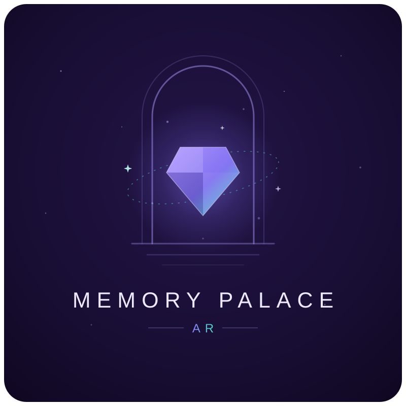

  

<h3 align="center"><em>Organize your mind in the world it already knows.</em></h3>

  An AR memory-palace trainer for <a href="https://www.specs.com/"><strong>SPECS</strong></a> —
  speak a memory, pin it to a real place, conjure bizarre imagery for it, then walk your
  palace and train until you don't need the Lens at all.

---

## What it is

Your brain is great at places and terrible at lists. The **method of loci** — the memory
palace — has exploited that for 2,500 years: put vivid imagery at locations along a route,
then walk the route in your mind. Memory Palace makes the palace *literal*: your actual
room, your actual walk, with AR gems marking each memory.

Speak a memory and a **gem** drops where you're looking, holding a photo of what you framed,
your words, and a spoken recital. One tap and the gem **conjures** — an LLM transforms your
literal words into bizarre, vivid mnemonic imagery ("buy milk" → *a giant carton of milk
with a clock face, hoisted by a muscular octopus*), generated as a 3D object or image that
cracks out of the gem where you placed it. Then **Train** hides everything and quizzes you
along the route until the palace lives in your head.

## The loop

| Mode | What happens |
|---|---|
| **New / Edit** | The capture wizard: aim → speak (ASR) → a gem drops with a photo of the framed spot. A mnemonic router (one LLM call) titles the memory, picks its imagery, and tags motion + particle recipes. One tap conjures. |
| **Explore** | A read-only walk. Distant memories are anonymous glints that twinkle; near ones **whisper their contents aloud** before you see them, then resolve. Gaze at a gem and its title blooms. |
| **Train** | The recall quiz. Everything hides; a spatial ping leads you to each locus in route order; you say what lives there, reveal, and self-grade. The interface **vanishes as mastery grows**: words → object only → blurred photo hint → bare glow. |

The **journey** is a first-class thing: a dashed violet→teal ribbon threads the loci in
order, the next locus wears a breathing ring, and memories are reorderable from their card.

## The craft

- **Motion is the encoding** — mnemonic research says static imagery underperforms, and
  Snap3D returns static GLB, so every conjured object is animated by an LLM-chosen recipe
  (spin / bob / pulse / orbit / swell + sparkle / smoke / burst / rain).
- **One key, one family** — every sound is crystal/glass/breath in a single solfeggio
  palette, procedurally synthesized (capture ping, placement thunk, forge hum, the
  hatch chord, grade tones). Overlapping sounds harmonize by construction.
- **Never block, never error-wall** — generation is async and optional; failures retry
  silently once, then degrade to the gem. Offline routing falls back locally.
- **Additive-display honest** — prompts demand luminous subjects because on SPECS'
  additive display, dark pixels are invisible.

## Built on

Lens Studio 5.23 · Spectacles Interaction Kit · Spectacles UIKit ·
ASR Module · CameraModule (framed snapshots via `DeviceCamera` intrinsics) ·
Remote Service Gateway → **GPT-4.1-nano** (mnemonic router) · **Snap3D** (text-to-3D) ·
**Imagen 3** (images) · **OpenAI TTS** (the palace speaks) ·
`persistentStorageSystem` (palaces survive) · procedural MeshBuilder + WAV synthesis.

## Running it

1. Open the project in **Lens Studio 5.23+**, signed in to your Snapchat account.
2. Generate Remote Service Gateway tokens (**Window → Remote Service Gateway Token**) —
   the AI features (router, conjuring, TTS) need them; everything else runs without.
3. Preview works fully in-editor: the mic falls back to a canned transcript, and SIK's
   mouse interactor drives every pinch. On SPECS, the sigil rides the back of your
   left hand.

## CLAD

This is a **CLAD Summer Hackathon** entry (week 1: *Organize*), built agentically —
the full prompt history, verification evidence, dead ends, and 2 AM bug hunts live in
[`PROMPTLOG.md`](PROMPTLOG.md). The design doc is [`DESIGN.md`](DESIGN.md); the visual
doctrine is [`Branding/STYLE.md`](Branding/STYLE.md).

  FLARB LLC · built with Claude Code + the Lens Studio MCP

